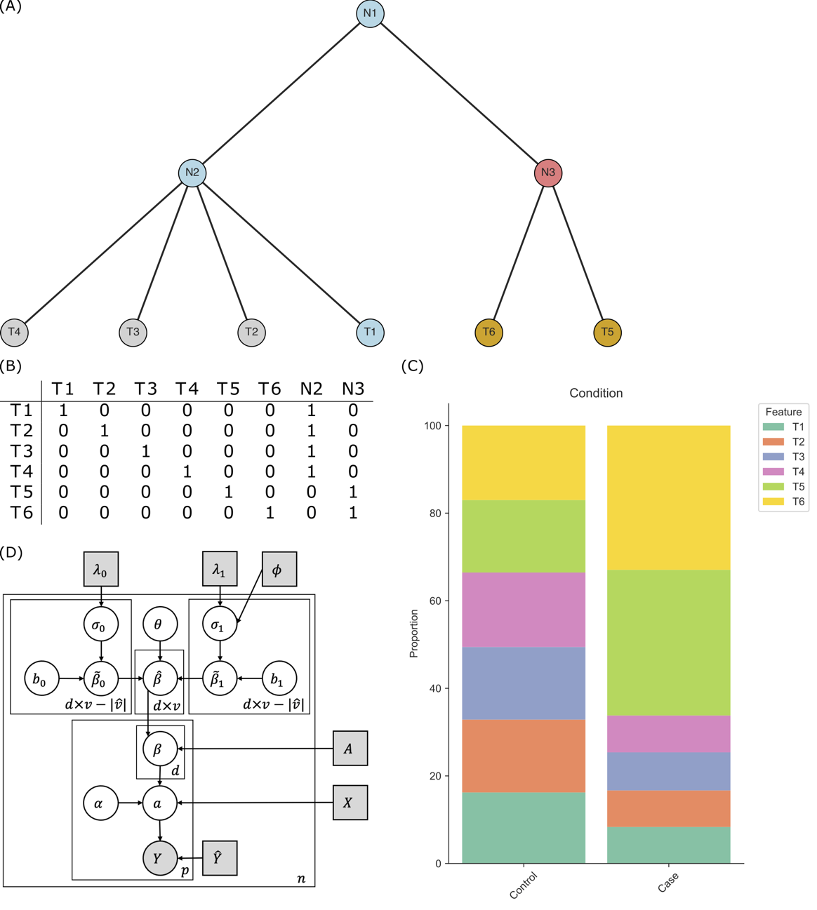

Welcome to tascCODA's documentation!
=============================================

tascCODA is a statistical model to analyze tree-aggregated changes in compositional data from high-throughput sequencing experiments.
The model in detail is described by
`Ostner et al. (2021) <https://www.frontiersin.org/articles/10.3389/fgene.2021.766405/full>`_.
Nevertheless, we want to give a short introduction to the intuition behind tascCODA.

The package is available on `github <https://github.com/bio-datascience/tascCODA>`_.

Please also check out the `tutorials <https://github.com/bio-datascience/tascCODA/blob/main/tutorials>`_
that explain the most important functionalities.

Motivation
^^^^^^^^^^^^

When analyzing biological processes via high-throughput sequencing (HTS) experiments, such as single-cell RNA sequencing or 16S rRNA sequencing,
it is often of interest to assess how cell populations change under one or more conditions.
This task, however, is non-trivial, as there are several limitations that have to be addressed:

- scRNA-seq population data is compositional. This must be considered to avoid an inflation of false-positive results.
- Most datasets consist only of few samples, making frequentist tests inaccurate.
- A condition usually only effects a fraction of features. Therefore, sparse effects are preferable.

The `scCODA <https://github.com/theislab/scCODA>`_ model `(Büttner, Ostner et al., 2021) <https://www.nature.com/articles/s41467-021-27150-6>`_ tackled these limitations in a fully Bayesian model, outperforming other
compositional and non-compositional methods.

In addition, HTS datasets are often ordered hierarchically by a tree structure, such as a cell lineage or taxonomic tree.
In many cases, a biological process can influence entire groups of features that form a subtree in the same manner.
For example, multiple types of T- and B-cells were found to be decreased in the intestinal epithelium in subjects with Ulcerative Colitis
(`Smillie et al., 2019 <https://doi.org/10.1016/j.cell.2019.06.029>`_).
tascCODA is an extension of scCODA that is able to infer these group-wise changes automatically in a dynamic fashion.
It creates a balance between the increased simplicity of aggregated effects with the lost accuracy of a less sparse model, that can be adjusted by the user as desired.

Note: Due to its similarity and dependency on scCODA, this documentation often links to the documentation of `scCODA <https://sccoda.readthedocs.io/en/latest>`_, wherever the two packages share functionality or API.

.. toctree::
    :caption: Contents
    :maxdepth: 2

    compositional_data
    data
    models
    installation
    api

.. toctree::
    :caption: Tutorials
    :maxdepth: 1

    tascCODA_tutorial

Reference
^^^^^^^^^^

Ostner *et al.* (2021), tascCODA: Bayesian Tree-Aggregated Analysis of Compositional Amplicon and Single-Cell Data
`Frontiers in Genetics <https://www.frontiersin.org/articles/10.3389/fgene.2021.766405/full>`_.
|dim|

Indices and tables
^^^^^^^^^^^^^^^^^^^^^^

* :ref:`genindex`
* :ref:`modindex`
* :ref:`search`

.. _scanpy: https://scanpy.readthedocs.io

.. |dim| raw:: html

   
   

