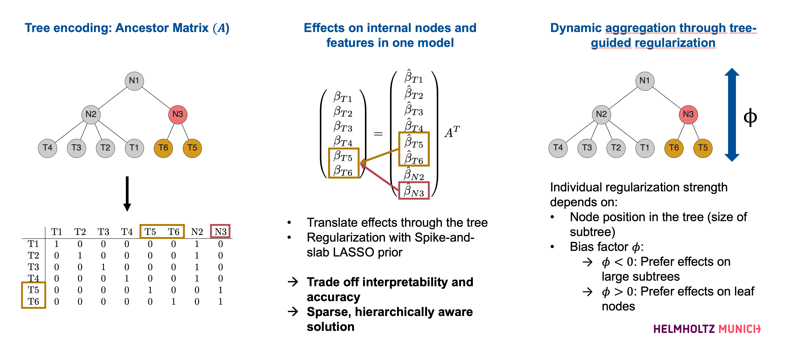

The tascCODA model
==================

tascCODA uses Bayesian modeling to detect statistically credible changes in compositional data.
The model is implemented in ``tasccoda.tree_agg_model_sslasso``.
The easiest way to call a compositional model is via calling an instance of ``tasccoda.tree_ana.CompositionalAnalysisTree``.
It requires an ``anndata`` object that contains the compositional data, covariates, and tree structure (in the form of a `toytree <https://toytree.readthedocs.io/en/latest/>`_ object),
as well as a formula string that defines the covariate matrix (see the `patsy <https://patsy.readthedocs.io/en/latest/>`_ syntax for details), and a reference feature.

Model structure
^^^^^^^^^^^^^^^

The model is based on a Dirichlet-multinomial model, in which each feature is described by the covariates through a log-linear linkage.
The intercepts :math:`\alpha` are modeled via a normal prior.

To relate covariates to features and groups of features at the same time, tascCODA uses the ancestor matrix :math:`A` of the tree structure
to extend the parameter space by effects on all internal nodes (:math:`\hat{\beta}`), which are then related back to the feature-only space :math:`\beta` via matrix multiplication

For the effect (:math:`\hat{\beta}`) of a covariate on a feature or group of features, tascCODA performs model selection via a spike-and-slab LASSO prior
(`Rockova and George, 2019 <https://www.tandfonline.com/doi/full/10.1080/01621459.2016.1260469>`_).
The regularization strength in this prior is scaled by the corresponding node's position in the tree and a bias factor :math:`\phi`,
to allow for different interpretations of the data, either preferring feature-level effects (:math:`\phi<0`) or high-level, generalizing aggregations (:math:`\phi>0`).
The only exception are the effects of the reference features :math:`\hat{v}`, which are always set to 0.

.. math::
         \begin{align*}
            Y_i &\sim \textrm{DirMult}(\bar{Y}_i, \textbf{a}(\textbf{x})_i)\\
            \log(\textbf{a}(X))_i &= \alpha + X_{i, \cdot} \beta\\
            \alpha_j &\sim \mathcal{N}(0, 10) & \forall j\in[p]\\
            \beta &= \hat{\beta} A^T \\
            \hat{\beta}_{l, k} &= 0 & \forall k \in \hat{v}, l \in [d]\\
            \hat{\beta}_{l, k} &= \theta \tilde{\beta}_{1, l, k} + (1- \theta) \tilde{\beta}_{0, l, k} \quad & \forall k\in\{[v] \setminus \hat{v}\}, l \in [d]\\
            \tilde{\beta}_{m, l, k} &= \sigma_{m, l, k} * b_{m, l, k} \quad & \forall k\in\{[v] \setminus \hat{v}\}, m \in \{0, 1\}, l \in [d]\\
            \sigma_{m, l, k} &\sim \textrm{Exp}(\lambda_{m, l, k}^2/2) \quad & \forall k\in\{[v] \setminus \hat{v}\}, l \in \{0, 1\}, l \in [d]\\
            b_{m, l, k} &\sim N(0,1) \quad & \forall k\in\{[v] \setminus \hat{v}\}, l \in \{0, 1\}, l \in [d]\\
            \theta &\sim \textrm{Beta}(1, \frac{1}{|\{[v] \setminus \hat{v}\}|})
        \end{align*}

For further information regarding the model structure and tree aggregation, please refer to:

Ostner *et al.* (2021), tascCODA: Bayesian Tree-Aggregated Analysis of Compositional Amplicon and Single-Cell Data
`Frontiers in Genetics <https://www.frontiersin.org/articles/10.3389/fgene.2021.766405/full>`_.

Inference
^^^^^^^^^

Once the model is set up, inference via HMC sampling can be performed via ``sample_hmc()``.
Alternatively, No-U-Turn sampling is available via ``sample_nuts()``.
Depending on the size of the dataset and the system hardware, inference usually takes a few minutes.
The resulting ``tasccoda.tree_results.CAResult_tree`` object extends the ``InferenceData`` class of
`arviz <https://arviz-devs.github.io/arviz/>`_ and supports all its diagnostic and plotting functionality.

Result analysis
^^^^^^^^^^^^^^^

To see which effects were found to be significant, call ``summary()`` on the result object.
The ``Final Parameter`` column of the node data frame shows which features or groups of features are significantly affected by which covariate.
If the value is 0, the effect is not found to be statistically credible, otherwise it is.
The sign of the effect indicates a decrease or increase in abundance (relative to the reference cell type).
However, the numerical value of these effects should not be used for analysis, as it depends on multiple parameters.
Please refer to the `tutorials <https://github.com/bio-datascience/tascCODA/blob/main/tutorials>`_ for more information on how to evaluate tascCODA's results.
